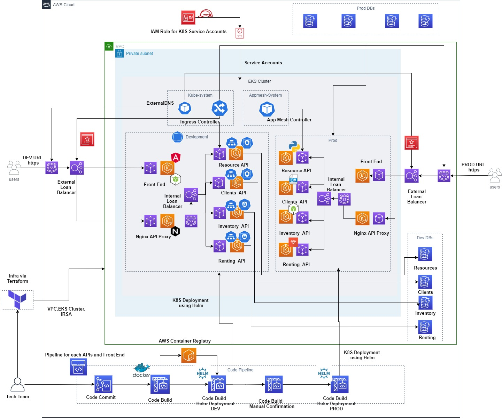
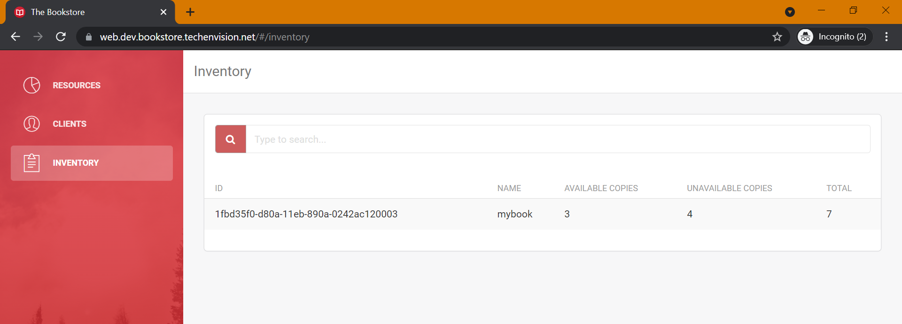

# BookStore Web Application On AWS EKS
A book store app powered by AWS EKS. Application is designed in microservices fashion running on EKS and integrating with other AWS Services. This project was based on learning from [ACloudGuru](https://acloudguru.com/course/a-practical-guide-to-amazon-eks)

## Key Features
1. AWS Infrastructure (IaC) via Terraform.
2. Microservice Style - APIs and Front End in different language.
3. Docker Compose for local testing.
4. Heml for Kubernetes Deployment.
5. IRSA for Kubernetes using IAM.
6. External DNS to manage Route53.
7. ALB Controller for Load Balancing.
8. App Mesh (Envoy) for Kubernetes.
9. X-Ray for Tracing.
10. CI/CD Pipeline for automated build and deployment of Kubernetes.

## Architecture



## Steps to run locally without build
I have already shared images on Docker Hub which can be directly used to run the application locally.
1. Create 4 DynamoDb tables into your AWS Cloud (development-inventory, development-resources, development-renting, development-clients)  by reffering tf_modules/dynamodb folder.
2. Run Docker compose file named `docker-compose-image.yaml` using command 
```
docker compose -f .\docker-compose-image.yaml up

```
3. Open the URL on `http://localhost:80`

## Steps to run locally with build
1. Create 4 DynamoDb tables into your AWS Cloud (development-inventory, development-resources, development-renting, development-clients)  by reffering tf_modules/dynamodb folder.
2. Run Docker compose file named `docker-compose.yaml` using command. It will take some time to build and start the containers.
```
docker compose up

```
3. Open the URL on `http://localhost:80`

## Steps to Deploy into AWS Cloud using Helm.
1. AWS CLI setup with Admin Role.
2. Generate Code Commit Authentication from IAM.
3. 
- Update Hosted zone in file `infrastructure\eks\terraform\terraform.tfvars` 
- Update details in file`infrastructure\openVPN\terraform\terraform.tfvars` for openVPN (required specifically for Elastic Search.). Read Readme.md file for more details about openVPN.
- Run `bookstore_create_infra.sh` to create infrastructure.
4. Update below files and run `bookstore_setup_k8s.sh`
- Update Cluster Name `--cluster-name` in  `infrastructure\k8s-tooling\alb-controller\alb-ingress-controller.yaml` file.
- Update Role ARN `roleARN` in `infrastructure\k8s-tooling\app-mesh\appmesh-sa\values.yaml` of Service Account for App Mesh. IAM Role ending with `sa-app-mesh-role`
5. Build Resource API and update `resource-api\infra\helm\values.development.yaml` file with Repo , Tag and Service Account Role ending with `development-sa-resource-api-role`
```
cd resource-api
docker build -t <Docker HUb Account>/bookstoreapp_resource-api .
docker push <Docker HUb Account>/bookstoreapp_resource-api
```
6. Run Resource API
```
./create.sh development
```
7. Build Inventory API and update `inventory-api\infra\helm\values.development.yaml` file with Repo , Tag and Service Account Role ending with `development-sa-inventory-api-role`
```
cd inventory-api
docker build -t <Docker HUb Account>/bookstoreapp_inventory-api .
docker push <Docker HUb Account>/bookstoreapp_inventory-api
```
8. Run Inventory API
```
./create.sh development
```
9. Build Clients API and update `clients-api\infra\helm\values.development.yaml` file with Repo , Tag and Service Account Role ending with `development-sa-clients-api-role`
```
cd clients-api
docker build -t <Docker HUb Account>/bookstoreapp_clients-api .
docker push <Docker HUb Account>/bookstoreapp_clients-api
```
10. Run Clients API
```
./create.sh development
```
11. Build Renting API and update `renting-api\infra\helm\values.development.yaml` file with Repo , Tag and Service Account Role ending with `development-sa-renting-api-role`
```
cd renting-api
docker build -t <Docker HUb Account>/bookstoreapp_renting-api .
docker push <Docker HUb Account>/bookstoreapp_renting-api
```
12. Run Renting API
```
./create.sh development
```
13. Build Front End and update `front-end\infra\helm\values.development.yaml` file with Repo , Tag and Service Account Role ending with `development-sa-renting-api-role` and Hosted Zone.
```
cd front-end
docker build -t <Docker HUb Account>/bookstoreapp_front-end .
docker push <Docker HUb Account>/bookstoreapp_front-end
```
14. Run Front End
```
./create.sh development
```
15. Go to infrastructure/k8s-tooling/central-ingress and update your own HOSTED ZONE and run
```
./create.sh development
```
16. Verify the Application using the URL.  https://dev.bookstore.`UR-HOSTED-ZONE`
17. Deploy production using below scripts.
```
cd resource-api
./create.sh prod
cd inventory-api
./create.sh prod
cd clients-api
./create.sh prod
cd renting-api
./create.sh prod
cd front-end
./create.sh prod
infrastructure/k8s-tooling/central-ingress
./create.sh prod
```
16. Verify the Application using the URL.  https://bookstore.`UR-HOSTED-ZONE`

## Steps to Deploy into AWS Cloud using CI/CD Pipeline
1. AWS CLI setup with Admin Role.
2. Generate Code Commit Authentication from IAM.
3. Update Hosted zone in file `infrastructure\eks\terraform\terraform.tfvars` and Run `bookstore_create_infra.sh` to create infrastructure.
4. Add RBAC for Code Build Jobs using below commands.
```
A. kubectl get -n kube-system configmap/aws-auth -o yaml
//Copy output and create YAML file and update it with each build job role.
- rolearn: <ROLE ARN>
      username: build-<APP NAME>
      groups:
      - system:masters
B. kubectl apply -f .\auth-config.yaml
```
5. Run cicd script to push codes into Code Commit.
```
./bookstore_cicd.sh 

```
6. Once deployment is complete in AWS CodePipeline for Dev stage. Go to infrastructure/k8s-tooling/central-ingress and update your own HOSTED ZONE and run
```
./create.sh development
```
7. Verify the Application using the URL.  https://dev.bookstore.`UR-HOSTED-ZONE`
8. Go to each Pipeline and confirm to deploy the application into production environment.
9. Once deployment is complete in AWS CodePipeline for Prod Stage. Go to infrastructure/k8s-tooling/central-ingress and update your own HOSTED ZONE and run
```
./create.sh prod
```
#### Access prodcution application via https://bookstore.`UR-HOSTED-ZONE`

**Note**- if Code Build is failing with error `toomanyrequests: You have reached your pull rate limit.`. You can run the job again after 5 min wait.

## Sample images.
1. Web Page-



2. X-Ray


## Clean Up step.
1. Delete namespaces. Go to `infrastructure\k8s-tooling\namespaces`
```
 kubectl delete -f development.yaml
 kubectl delete -f prod.yaml
 kubectl delete -f appmesh-system.yaml
```
2. Remove K8S. 
```
kubectl delete -f infrastructure\k8s-tooling\alb-controller\alb-ingress-controller.yaml
kubectl delete -f infrastructure\k8s-tooling\external-dns\external-dns.yaml
```
3. Delete AwS resource from Terraform.
- Go to each API Folder/infra/terraform and run `terraform destroy`
- Go to  infrastructure\cicd\terraform and run `terraform destroy`
- Go to infrastructure\eks\terraform and run `terraform destroy`


